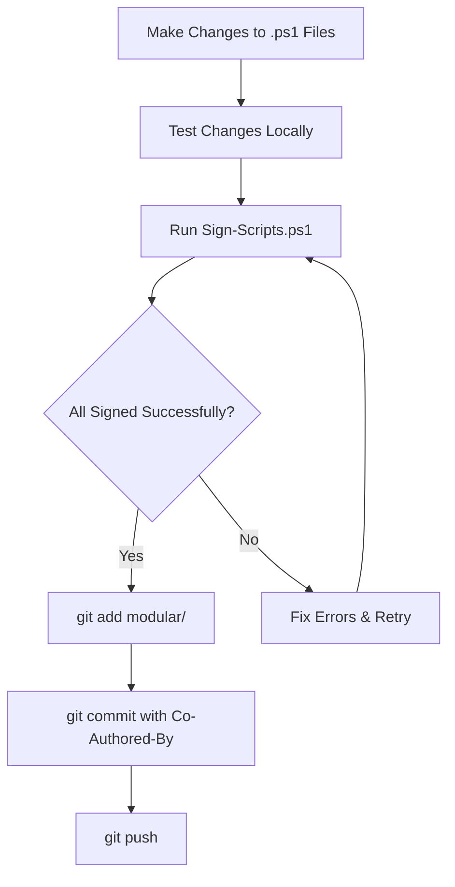

# AI Agent Workflow Reminders

## CRITICAL: Code Signing Workflow

### Before Every Push to GitHub

**ALWAYS run the signing script before committing PowerShell changes:**

```powershell
# Step 1: Navigate to modular directory
cd "C:\Users\EdBrownlee\OneDrive - N2CON Inc\Documents\GitHub\PS_Netbird_Master_Script\modular"

# Step 2: Sign all scripts
.\Sign-Scripts.ps1

# Step 3: Verify all scripts signed successfully
# Output should show: "[SUCCESS] All scripts signed successfully!"

# Step 4: Stage signed files
git add modular/

# Step 5: Commit with appropriate message
git commit -m "chore: Sign modular PowerShell scripts

Co-Authored-By: Warp <agent@warp.dev>"

# Step 6: Push to GitHub
git push
```

### Why This Is Critical

1. **Security**: Scripts must be signed for AllSigned execution policy
2. **Enterprise Requirements**: Many organizations require signed scripts
3. **Trust**: Validates scripts haven't been tampered with
4. **Compliance**: Required for production deployments

### When to Sign

Sign scripts whenever you:
- ✅ Create new PowerShell (.ps1) files
- ✅ Modify existing PowerShell files
- ✅ Update any script in the modular/ directory
- ✅ Make ANY changes to bootstrap.ps1, launcher, or modules

### Certificate Details

- **Certificate**: N2con Code Signing Certificate
- **Subject**: ed@n2con.com
- **Valid Until**: 09/27/2028
- **Timestamp Server**: DigiCert (http://timestamp.digicert.com)

### Signing Script Location

`modular/Sign-Scripts.ps1`

This script:
- Auto-detects the code signing certificate
- Signs all .ps1 files in modular/ (recursively)
- Timestamps signatures for long-term validity
- Verifies all signatures
- Provides clear success/failure reporting

### What Gets Signed

The signing script signs ALL .ps1 files in:
- `modular/*.ps1` (bootstrap, launcher, etc.)
- `modular/modules/*.ps1` (all modules)
- `modular/intune/*.ps1` (Intune remediation scripts)
- Any subdirectories with PowerShell scripts

**Exceptions**: The Sign-Scripts.ps1 file itself is not signed.

## Standard Workflow for PowerShell Changes



## Commit Message Format

### For Signed Scripts (Use this after running Sign-Scripts.ps1)

```
chore: Sign modular PowerShell scripts

[Optional: Brief description of what was changed before signing]

Co-Authored-By: Warp <agent@warp.dev>
```

### For Feature Changes (Use this for the initial functional commit)

```
feat: [Brief description]

[Detailed changes]

Co-Authored-By: Warp <agent@warp.dev>
```

**Then immediately follow with signing and a separate commit.**

## Two-Commit Pattern

For significant changes, use a two-commit pattern:

```bash
# Commit 1: Functional changes (unsigned)
git add modular/
git commit -m "feat: Add new feature

[Details]

Co-Authored-By: Warp <agent@warp.dev>"

# Commit 2: Sign the scripts
./Sign-Scripts.ps1
git add modular/
git commit -m "chore: Sign modular PowerShell scripts

Co-Authored-By: Warp <agent@warp.dev>"

# Push both commits together
git push
```

## Troubleshooting

### Certificate Not Found

```powershell
# List available code signing certificates
Get-ChildItem -Path Cert:\CurrentUser\My -CodeSigningCert
Get-ChildItem -Path Cert:\LocalMachine\My -CodeSigningCert

# If no certificate exists, contact IT for certificate installation
```

### Signature Verification Fails

```powershell
# Check signature status of a file
Get-AuthenticodeSignature "path\to\file.ps1"

# Common issues:
# - Certificate expired: Get new certificate
# - Timestamp server unreachable: Retry or use different timestamp server
# - File modified after signing: Re-sign the file
```

### Signing Fails on Some Files

1. Check file permissions (must have write access)
2. Ensure file is not open in another process
3. Verify file is a valid PowerShell script
4. Check certificate has not expired

## Quick Reference

| Action | Command |
|--------|---------|
| Sign all scripts | `.\Sign-Scripts.ps1` |
| Sign with specific cert | `.\Sign-Scripts.ps1 -CertificateThumbprint "THUMBPRINT"` |
| Verify signature | `Get-AuthenticodeSignature file.ps1` |
| List certificates | `Get-ChildItem Cert:\CurrentUser\My -CodeSigningCert` |

## Important Notes

- **Never commit unsigned PowerShell scripts** to the repository
- **Always verify** the signing script completed successfully before pushing
- **Co-Author attribution** must be included in all commits
- **Timestamp** ensures signatures remain valid after certificate expires
- **Certificate expires**: 09/27/2028 - mark calendar for renewal

## AI Agent Specific Reminders

When working as an AI agent:

1. **After any .ps1 file changes**: Immediately run Sign-Scripts.ps1
2. **Before git push**: Verify all scripts are signed
3. **Check output**: Ensure "All scripts signed successfully!" message
4. **Two commits**: Use two-commit pattern for significant changes
5. **Document**: Update this file if workflow changes

## Last Updated

This document was created on: 2025-12-19
Last certificate verification: 2025-12-19 (valid until 09/27/2028)

---

**Remember**: Signing is not optional - it's a required security step for all PowerShell deployments in enterprise environments.
