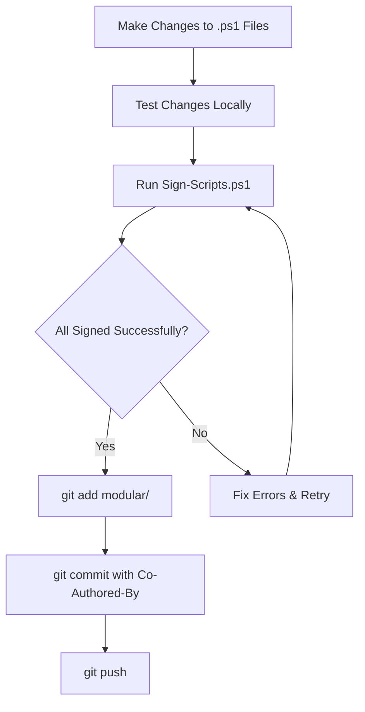

# AI Agent Workflow Reminders

## CRITICAL: Code Signing Workflow

### Before Every Push to GitHub

**ALWAYS run the signing script before committing PowerShell changes:**

```powershell
# Step 1: Navigate to modular directory
cd "C:\Users\EdBrownlee\OneDrive - N2CON Inc\Documents\GitHub\PS_Netbird_Master_Script\modular"

# Step 2: Sign all scripts
.\Sign-Scripts.ps1

# Step 3: Verify all scripts signed successfully
# Output should show: "[SUCCESS] All scripts signed successfully!"

# Step 4: Stage signed files
git add modular/

# Step 5: Commit with appropriate message
git commit -m "chore: Sign modular PowerShell scripts

Co-Authored-By: Warp <agent@warp.dev>"

# Step 6: Push to GitHub
git push
```

### Why This Is Critical

1. **Security**: Scripts must be signed for AllSigned execution policy
2. **Enterprise Requirements**: Many organizations require signed scripts
3. **Trust**: Validates scripts haven't been tampered with
4. **Compliance**: Required for production deployments

### When to Sign

Sign scripts whenever you:
- ✅ Create new PowerShell (.ps1) files
- ✅ Modify existing PowerShell files
- ✅ Update any script in the modular/ directory
- ✅ Make ANY changes to bootstrap.ps1, launcher, or modules

### Certificate Details

- **Certificate**: N2con Code Signing Certificate
- **Subject**: ed@n2con.com
- **Valid Until**: 09/27/2028
- **Timestamp Server**: DigiCert (http://timestamp.digicert.com)

### Signing Script Location

`modular/Sign-Scripts.ps1`

This script:
- Auto-detects the code signing certificate
- Signs all .ps1 files in modular/ (recursively)
- Timestamps signatures for long-term validity
- Verifies all signatures
- Provides clear success/failure reporting

### What Gets Signed

The signing script signs ALL .ps1 files in:
- `modular/*.ps1` (bootstrap, launcher, etc.)
- `modular/modules/*.ps1` (all modules)
- `modular/intune/*.ps1` (Intune remediation scripts)
- Any subdirectories with PowerShell scripts

**Exceptions**: The Sign-Scripts.ps1 file itself is not signed.

## Standard Workflow for PowerShell Changes



## Commit Message Format

### For Signed Scripts (Use this after running Sign-Scripts.ps1)

```
chore: Sign modular PowerShell scripts

[Optional: Brief description of what was changed before signing]

Co-Authored-By: Warp <agent@warp.dev>
```

### For Feature Changes (Use this for the initial functional commit)

```
feat: [Brief description]

[Detailed changes]

Co-Authored-By: Warp <agent@warp.dev>
```

**Then immediately follow with signing and a separate commit.**

## Two-Commit Pattern

For significant changes, use a two-commit pattern:

```bash
# Commit 1: Functional changes (unsigned)
git add modular/
git commit -m "feat: Add new feature

[Details]

Co-Authored-By: Warp <agent@warp.dev>"

# Commit 2: Sign the scripts
./Sign-Scripts.ps1
git add modular/
git commit -m "chore: Sign modular PowerShell scripts

Co-Authored-By: Warp <agent@warp.dev>"

# Push both commits together
git push
```

## Troubleshooting

### Certificate Not Found

```powershell
# List available code signing certificates
Get-ChildItem -Path Cert:\CurrentUser\My -CodeSigningCert
Get-ChildItem -Path Cert:\LocalMachine\My -CodeSigningCert

# If no certificate exists, contact IT for certificate installation
```

### Signature Verification Fails

```powershell
# Check signature status of a file
Get-AuthenticodeSignature "path\to\file.ps1"

# Common issues:
# - Certificate expired: Get new certificate
# - Timestamp server unreachable: Retry or use different timestamp server
# - File modified after signing: Re-sign the file
```

### Signing Fails on Some Files

1. Check file permissions (must have write access)
2. Ensure file is not open in another process
3. Verify file is a valid PowerShell script
4. Check certificate has not expired

## Quick Reference

| Action | Command |
|--------|---------|
| Sign all scripts | `.\Sign-Scripts.ps1` |
| Sign with specific cert | `.\Sign-Scripts.ps1 -CertificateThumbprint "THUMBPRINT"` |
| Verify signature | `Get-AuthenticodeSignature file.ps1` |
| List certificates | `Get-ChildItem Cert:\CurrentUser\My -CodeSigningCert` |

## Important Notes

- **Never commit unsigned PowerShell scripts** to the repository
- **Always verify** the signing script completed successfully before pushing
- **Co-Author attribution** must be included in all commits
- **Timestamp** ensures signatures remain valid after certificate expires
- **Certificate expires**: 09/27/2028 - mark calendar for renewal

## CRITICAL: Handling Signed Scripts from GitHub

### The Problem: Invoke-WebRequest -OutFile Corrupts Signatures

**NEVER use `-OutFile` when downloading signed PowerShell scripts from GitHub!**

`Invoke-WebRequest -OutFile` modifies line endings (CRLF ↔ LF) when saving to disk, which:
- Changes the file hash
- Invalidates the digital signature
- Causes "hash does not match" errors on AllSigned policy machines

### The Solution: Fetch and Execute Directly

**CORRECT** way to handle signed scripts from GitHub:

```powershell
# ✅ CORRECT - Preserves signatures
$script = Invoke-RestMethod -Uri $url -UseBasicParsing
$scriptBlock = [scriptblock]::Create($script)
& $scriptBlock @parameters
```

**INCORRECT** ways that break signatures:

```powershell
# ❌ WRONG - Corrupts signatures
Invoke-WebRequest -Uri $url -OutFile file.ps1
& .\file.ps1 @parameters

# ❌ WRONG - Also corrupts signatures  
irm $url -OutFile file.ps1
& .\file.ps1 @parameters
```

### Why This Matters

1. **Git stores with LF line endings** (configured in `.gitattributes`)
2. **Windows PowerShell expects CRLF** in some contexts
3. **Invoke-WebRequest -OutFile converts line endings** when saving
4. **Line ending changes = different file hash = invalid signature**
5. **Result**: Script won't run on AllSigned execution policy machines

### When This Applies

 Apply this rule whenever:
- ✅ Fetching any signed .ps1 script from GitHub
- ✅ Writing bootstrap/wrapper scripts that fetch other scripts
- ✅ Creating RMM deployment scripts
- ✅ Building Intune packages that download scripts
- ✅ Any scenario where you fetch signed scripts remotely

### Real-World Example: bootstrap.ps1

**Version 1.1.0 (BROKEN)**:
```powershell
Invoke-WebRequest -Uri $LauncherUrl -OutFile $LauncherPath -UseBasicParsing
& $LauncherPath @LauncherArgs  # ❌ Signature invalid!
```

**Version 1.2.0 (FIXED)**:
```powershell
$LauncherScript = Invoke-RestMethod -Uri $LauncherUrl -UseBasicParsing
$ScriptBlock = [scriptblock]::Create($LauncherScript)
& $ScriptBlock @LauncherArgs  # ✅ Signature valid!
```

### Testing Signed Scripts

To verify a script signature is valid:

```powershell
# Check local file signature
Get-AuthenticodeSignature .\bootstrap.ps1

# Output should show:
# Status: Valid
# SignerCertificate: CN=ed@n2con.com
```

If you see `Status: HashMismatch`, the file was modified after signing (likely by line ending changes).

### Exception: When -OutFile Is OK

The `-OutFile` restriction ONLY applies to **signed PowerShell scripts**. It's fine for:
- ✅ Downloading unsigned scripts (but still avoid for consistency)
- ✅ Downloading binary files (.exe, .msi, .zip)
- ✅ Downloading data files (.json, .txt, .xml)
- ✅ Downloading non-executable content

### Quick Reference

| Scenario | Correct Approach |
|----------|------------------|
| Fetch signed .ps1 from GitHub | `irm \$url \| iex` or scriptblock pattern |
| Fetch unsigned .ps1 | Same as signed (for consistency) |
| Download .exe/.msi | `-OutFile` is OK |
| Download binary/data | `-OutFile` is OK |
| Execute with parameters | Use scriptblock: `& [scriptblock]::Create($script) @params` |

### Impact on This Project

All signed scripts in this repository must be fetched using the signature-preserving pattern:
- `modular/bootstrap.ps1` ✅ Fixed in v1.2.0
- `modular/netbird.launcher.ps1` ✅ Called via scriptblock
- `modular/modules/*.ps1` ✅ Loaded via dot-sourcing in launcher
- `modular/intune/*.ps1` ✅ Can be deployed directly (Intune handles correctly)

### Troubleshooting

**Error**: "hash of the file does not match the hash stored in the digital signature"

**Cause**: File was saved to disk with `-OutFile` after being signed

**Fix**: Change to fetch-and-execute pattern (no disk save)

**Prevention**: Always use the scriptblock pattern shown above

## AI Agent Specific Reminders

When working as an AI agent:

1. **After any .ps1 file changes**: Immediately run Sign-Scripts.ps1
2. **Before git push**: Verify all scripts are signed
3. **Check output**: Ensure "All scripts signed successfully!" message
4. **Two commits**: Use two-commit pattern for significant changes
5. **Document**: Update this file if workflow changes

## Last Updated

This document was created on: 2025-12-19
Last modified: 2025-12-19 (Added signed script handling from GitHub section)
Last certificate verification: 2025-12-19 (valid until 09/27/2028)

---

**Remember**: 
1. Signing is not optional - it's a required security step for all PowerShell deployments
2. Never use `-OutFile` with signed scripts - it corrupts signatures by changing line endings
3. Always fetch and execute via scriptblock to preserve signatures
